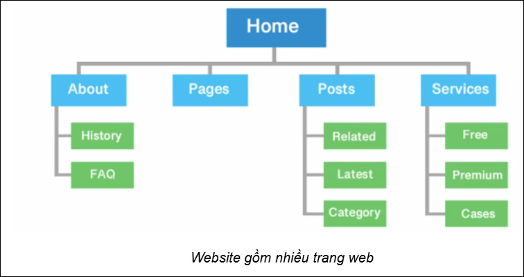
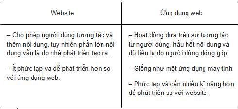
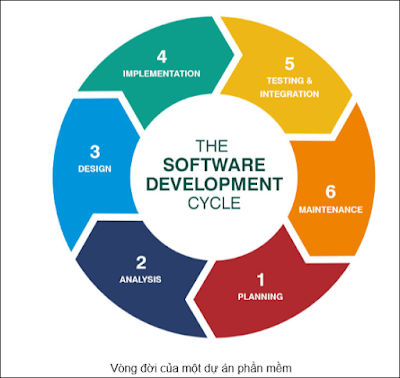
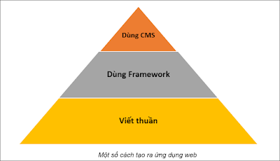
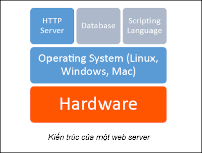
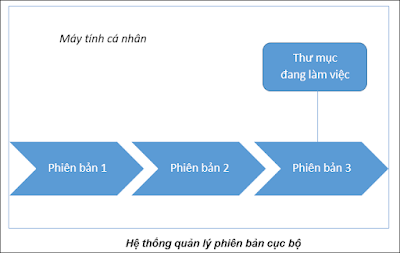
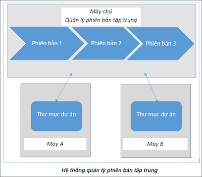
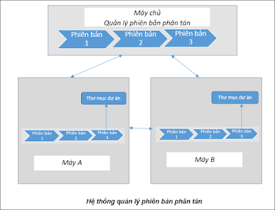
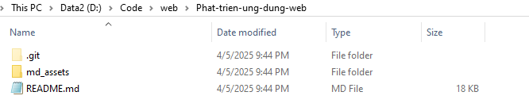
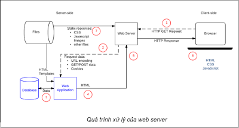

# Self note dành cho môn Phát triển ứng dụng web
## Giảng viên hướng dẫn: 
* Thầy Lê Gia Công
## Tác giả
* Ngô Bá Tài
## Chương 1: Web back-end
### 1.1 Một số khái niệm cơ bản
* **Web:** Web hay WWW là từ viết tắt của World Wide Web là mạng lưới thông tin toàn cầu. Web bao gồm rất nhiều các trang web kết nối lại với nhau, với thông tin đa dạng như văn bản, 
  hình ảnh, âm thanh, video và nhiều loại dữ liệu khác
* **Trang web(web page):** là một trang tài liệu trên hệ thống web. Trang web có thể chứa văn bản, hình ảnh, âm thanh, video, và các nội dung đa phương tiện khác.
  * Trang web được tạo ra bằng HTML, CSS, JavaScript và một trong các ngôn ngữ lập trình phía server(Python, JavaScript, C#, PHP, Go, Java, Ruby...)
  * Mã nguồn của trang web được lưu trên máy chủ (máy web server)
  * Mỗi trang web có một địa chỉ URL duy nhất. URL là một chuỗi ký tự, xác định vị trí của một trang web trên Internet
  * Trang web có thể được dùng để: cung cấp thông tin, bán hàng, chia sẻ ý kiến, kết nối mọi người, giáo dục, quản lý, giải trí
* **Website:** Website là một tập hợp nhiều trang web có liên quan đến nhau, có một địa chỉ URL duy nhất

* **Ứng dụng web (web application hay web app):** là một loại ứng dụng mà người dùng có thể truy cập và sử dụng thông qua Internet hoặc mạng nội bộ (hoặc trên máy cục bộ) bằng trình 
  duyệt web. Ví dụ: Google Drive
  * Một số đặc điểm:
      * Mã nguồn của ứng dụng web được để trên máy server, giao diện ứng dụng web được hiển thị trên trình duyệt
      * Ứng dụng web hoạt động dựa trên mô hình client-server
      * Không có sự phân biệt rõ ràng giữa website và ứng dụng web
  * Điểm khác nhau giữa Website và Ứng dụng web:
    
  
### 1.2 Phát triển ứng dụng web là gì?
Phát triển ứng dụng web là quá trình tạo ra ứng dụng web

Tạo ra ứng dụng web cũng là quá trình tạo ra ứng dụng máy tính hay phần mềm nói chung, vì vậy nó cũng cần trải qua các giai đoạn cơ bản như:
- Lập dự án

- Xác định yêu cầu

- Phân tích

- Thiết kế

- Lập trình

- Triển khai

- Bảo trì và cập nhật

#### 1.2.1 Một số cách để tạo ra ứng dụng web
- Sử dụng hệ quản trị nội dung

- Sử dụng framework và thư viện hỗ trợ

- Viết thuần bằng ngôn ngữ lập trình mà không sử dụng framework và thư viện hỗ trợ

* Hệ quản trị nội dung (Content Management System - CMS) là một phần mềm hoặc một tập hợp các phần mềm được sử dụng để tạo, quản lý và sửa đổi nội dung trên một trang web mà 
  không cần đến các kiến thức chuyên sâu về lập trình. Ví dụ: WordPress, Wix, Joomla, Drupal, Magento, Shopify, WordPress, Blogger...
  * Các chức năng chính của một CMS:
    - Tạo và quản lý nội dung: cho phép người dùng dễ dàng tạo, chỉnh sửa, xóa và sắp xếp nội dung (văn bản, hình ảnh, video) trên trang web

    - Quản lý người dùng: cho phép phân quyền truy cập và quản lý các tài khoản người dùng khác nhau, ví dụ: quản trị viên, nhân viên, biên tập viên, tác giả.

    - Quản lý giao diện: cho phép tùy chỉnh giao diện của trang web thông qua các mẫu giao diện (template), các kho giao diện (theme)

    - Quản lý các mô-đun, các tiện ích bổ sung: cho phép mở rộng chức năng của trang web thông qua việc cài đặt các mô-đun (module) hoặc các tiện ích bổ sung (plugin)

    - Tối ưu hóa SEO: hỗ trợ các công cụ và tính năng để tối ưu hóa công cụ tìm kiếm (SEO) cho trang web, giúp trang web dễ dàng được tìm thấy trên các công cụ tìm kiếm như Google
  * Ưu điểm của CMS:
    - Dễ sử dụng, dễ quản lý, tiết kiệm thời gian

    - Không cần kiến thức lập trình chuyên sâu

    - Linh hoạt trong việc lựa chọn giao diện, các mô-đun chức năng

    - Tối ưu SEO

    - Chi phí phát triển ứng dụng thấp
  * Nhược điểm của CMS:
    - Vấn đề bảo mật, tấn công hệ thống

    - Hiệu suất, tốc độ thực thi có thể chậm nếu không được tối ưu đúng cách; mã nguồn lớn, dư thừa

    - Khả năng tùy chỉnh chức năng thấp

    - Phụ thuộc hạ tầng, công nghệ, chức năng vào nhà cung cấp
* Frameword và thư viện hỗ trợ:
  - Frontend: jQuery, Bootstrap, D3, React, Angular, Vue, Svelte 

  - Backend: Express.js (Nodejs), Django, Flask (Python), ASP.NET (C#), Spring Boot (Java), Laravel (PHP), Ruby on Rails (Ruby), Gin, Echo (Go, Golang)
    
  - Ưu điểm khi sử dụng framework và thư viện:
      - Tăng tốc độ phát triển
      - Cải thiện chất lượng viết mã
      - Tăng cường bảo mật
      - Dễ dàng bảo trì và mở rộng
      - Cộng đồng hỗ trợ lớn
  - Nhược điểm của việc sử dụng framework:
    - Để sử dụng một framework hiệu quả, bạn cần phải dành thời gian để học và làm quen với nó

    - Một số framework có thể làm tăng kích thước của ứng dụng, các ứng dụng quá đơn giản thì không nhất thiết phải dùng framework

    - Một số framework có thể hạn chế khả năng tùy chỉnh của bạn
* Viết thuần: Việc phát triển ứng dụng web bằng cách tự viết mã từ đầu (hay còn gọi là "viết thuần”, “viết tay") cũng là một cách bạn có thể sử dụng để tạo ra ứng dụng web. Bạn sẽ không 
  sử dụng bất kì framework hay thư viện hỗ trợ nào. Các ngôn ngữ bạn sẽ sử dụng:
  - Frontend: HTML, CSS, JavaScript
  - Backend: một trong các ngôn ngữ lập trình: JavaScript, Python, C#, PHP, Java, Go, Ruby
  - Ưu điểm:
    - Toàn quyền kiểm soát và tùy chỉnh mã nguồn, không bị bất kì ràng buộc hay giới hạn nào

    - Tối ưu hóa mã nguồn để ứng dụng chạy nhanh và hiệu quả nhất

    - Hiểu rất sâu và nắm vững các ngôn ngữ lập trình, kỹ thuật lập trình, kỹ thuật bảo mật, công nghệ web

    - Tư duy logic và giải quyết vấn đề tố
  - Nhược điểm:
    - Tốn thời gian, công sức

    - Khối lượng công việc rất lớn

    - Yêu cần kiến thức chuyên môn cao, toàn diện

    - Khó bảo trì và mở rộng

    - Chi phí cao
### 1.3 Web Server
Web server (máy chủ web) là một máy tính (hoặc một phần mềm), được sử dụng để lưu trữ và cung cấp toàn bộ nội dung cho một website/ứng dụng web (tạm gọi chung là ứng dụng web).
Một số chức năng chính của web server
- Lưu trữ các tập tin của ứng dụng web: web server lưu trữ tất cả các tập tin và dữ liệu tạo nên ứng dụng web, ví dụ các tập tin HTML, hình ảnh và video.

- Nhận yêu cầu (request): khi người dùng truy cập một ứng dụng web, trình duyệt web của họ sẽ gửi một request tới web server. Web server sẽ tiếp nhận request này.

- Xử lý request: sau khi nhận được request, web server sẽ thực hiện xử lý request. Việc xử lý request có thể là: đọc nội dung các tập tin, thực thi các đoạn mã nguồn, kết nối và làm việc với cơ sở dữ liệu.

- Gửi phản hồi (response): sau khi xử lý xong request, web server sẽ gửi response cho trình duyệt của người dùng, sau đó, trình duyệt sẽ hiển thị kết quả response cho người dùng

* Một số phần mềm web server phổ biến: Apache, Nginx, NodeJS, IIS, Tom cat, Lighttpd
* Kiến trúc của 1 web server
  

* Một máy web server có các đặc điểm sau:

  - Phần cứng là một máy server chuyên dụng, cấu hình mạnh, khả năng chịu lỗi cao, chạy liên tục

  - Hệ điều hành dành cho máy chủ

  - Có cài đặt phần mềm web server (HTTP server - Apache, Nginx, IIS), có thể có hệ quản trị cơ sở dữ liệu (Database), trình dịch và thực thi mã nguồn (Scripting Language)
#### 1.3.1 Nginx
Nginx là phần mềm web server mã nguồn mở
* Một số lệnh quan trọng của nginx
- start nginx: khởi chạy Nginx 

- nginx -s stop: tắt Nginx ngay lập tức

- nginx -s quit: không chấp nhận kết nối mới, chờ các client hoàn thành tác vụ dang dở rồi mới tắt Nginx

- nginx -s reload: thay đổi cấu hình, khởi chạy lại worker process với cấu hình mới

- nginx -s reopen: mở lại các tập tin log
## Chương 2: Git thực hành
### 2.1 Hệ thống quản lý phiên bản
* **Phiên bản(version):** là các bản khác nhau của tập tin, thư mục hoặc toàn bộ mã nguồn dự án (từ đây gọi chung là dự án để tiện trình bày)
* **Hệ thống quản lý phiên bản (Version Control System - VCS):** một phần mềm giúp chúng ta lưu lại từng thay đổi của mã nguồn dự án, và giúp lấy lại được các phiên bản trước đó nếu 
  cần.
  * Các chức năng chính:
    - Khôi phục lại trạng thái của dự án ở các thời điểm khác nhau trong quá khứ

    - Biết được ai đã thực hiện các thay đổi trên dự án, và đã thay đổi những gì

    - Dễ dàng khôi phục lại các nội dung mã nguồn bị xóa 

    - Dễ dàng so sánh những thay đổi của dự án theo các mốc thời gian
  * Phân loại:
    - Hệ thống quản lý phiên bản cục bộ

    - Hệ thống quản lý phiên bản tập trung

    - Hệ thống quản lý phiên bản phân tán

#### 2.1.1 Hệ thống quản lý phiên bản cục bộ
phương pháp tự lưu trữ các phiên bản của thư mục dự án ở các thời điểm khác nhau trong quá trình làm việc thành các tên khác nhau. 

* Ưu điểm:
  * Hiệu suất nhanh
  * Tự kiểm soát dữ liệu
  * Dễ quản lý
  * Làm việc offline
* Nhược điểm:
  * Không hỗ trợ làm việc nhóm
  * Không có backup tự động
  * Khó kiểm soát khi số lượng phiên bản lớn
#### 2.1.2 Hệ thống quản lý phiên bản tập trung
Gồm máy chủ chứa các phiên bản của thư mục dự án và danh sách các máy khách được phép thay đổi thư mục dự án trên máy chủ. Các máy khách sẽ lấy các phiên bản của thư mục dự án từ máy chủ về, thực hiện các thay đổi trên thư mục dự án và cập nhật lại các thay đổi về máy chủ

* Ưu điểm:
  * Dễ quản lý tập trung
  * Hỗ trợ làm việc nhóm
  * Phân quyền dễ dàng
  * Nhật ký thay đổi rõ ràng
  * Dung lượng máy client nhẹ
* Nhược điểm:
  * Phụ thuộc lớn vào server
  * Phụ thuộc vào mạng
  * Không làm việc offline
#### 2.1.3 Hệ thống quản lý phiên bản phân tán
Các máy client không chỉ lấy thư mục mới nhất như **hệ thống quản lý phiên bản tập trung** mà nó còn chép toàn bộ cả kho chứa (repository, repo), trong đó bao gồm cả lịch sử các phiên bản

* Ưu điểm:
  * Mỗi client đều có bản sao đầy đủ
  * Làm việc offline dễ dàng
  * Bảo mật và an toàn cao
  * Quản lý nhánh mạnh mẽ
  * Hiệu suất cao khi làm việc nhóm
* Nhược điểm:
  * Tốn dung lượng máy client
  * Cần cấu hình remote hợp lý
  * phụ thuộc vào tool khi merge
### 2.2 Tổng quan về git
#### 2.2.1 Git là gì?
Git là một hệ thống quản lý phiên bản phân tán (distributed version control system) được sử dụng rộng rãi trong phát triển phần mềm. Nó cho phép các nhóm lập trình viên theo dõi và quản lý các thay đổi trong mã nguồn của một dự án một cách hiệu quả

Một số tính năng của Git:
- Theo dõi lịch sử thay đổi: Git lưu lại từng thay đổi nhỏ nhất của mã nguồn, giúp bạn dễ dàng quay lại các phiên bản trước đó nếu cần

- Cộng tác hiệu quả: Git cho phép nhiều người cùng làm việc trên một dự án cùng lúc, đồng thời hợp nhất các thay đổi một cách dễ dàng

- Phân nhánh và hợp nhất: Git hỗ trợ tạo nhiều nhánh (branch) làm việc độc lập, giúp bạn thử nghiệm các tính năng mới mà không ảnh hưởng đến phần còn lại của dự án

- Bảo mật: Git lưu trữ các thay đổi dưới dạng các bản ghi (commit) không thể thay đổi, đảm bảo tính toàn vẹn của mã nguồn

- Phân tán: mỗi bản sao của một kho lưu trữ Git đều là một kho lưu trữ đầy đủ, cho phép bạn làm việc không cần kết nối mạng và đồng bộ hóa sau đó (khi có kết nối mạng)
#### 2.2.2 Nhúng Git vào dự án
Mặc dù Git đã được tích hợp vào các phần mềm lập trình (ví dụ Visual Studio, Eclipse, VS code). Tuy nhiên, cách học Git hiệu quả nhất vẫn là sử dụng giao diện dòng lệnh. Giao diện dòng lệnh chứa đầy đủ nhất các lệnh của Git, khi đã hiểu được bản chất các lệnh rồi thì chuyển sang sử dụng các giao diện khác rất đơn giản.

Các bước nhúng Git vào dự án:
* B1: Di chuyển vào thư mục dự án bằng lệnh cd trong CLI
* B2: Gõ lệnh git init (Nếu thành công thì sẽ hiện thông báo "initialized empty Git repository in [Path của ban]")
* B3: Quan sát sự thay đổi của thư mục dự án (Có thêm thư mục .git - Đây chính là kho chứa (kho lưu trữ) mà phần mềm Git thêm tạo ra trong thư mục dự án để sử dụng cho các tác vụ của nó)

## Chương 3: Trắc nghiệm
Câu 1.3: Phát biểu nào không đúng khi nói về web, trang web và website?

A. Web là hệ thống thông tin toàn cầu

B. Web được tạo thành nhờ các trang web và sự liên kết giữa chúng

**C. Một trang web chứa nhiều website**

D. Một website chứa nhiều trang web có liên quan đến nhau

Câu 1.4: Phát biểu nào không đúng khi nói về website và ứng dụng web?

A. Không có sự phân biệt rõ ràng giữa website và ứng dụng web

B. Một website và ứng dụng web có một địa chỉ URL để truy cập

C. Website và ứng dụng web hoạt động dựa trên mô hình client-server

**D. Chỉ cần sử dụng HTML và CSS là có thể tạo ra được ứng dụng web**

2. Phát triển ứng dụng Web

Câu 2.3: Có 3 cách để tạo ra một ứng dụng web? Phát biểu nào không đúng?

A. Sử dụng CMS

B. Sử dụng framework và thư viện hỗ trợ

C. Viết thuần bằng ngôn ngữ lập trình mà không sử dụng framework, thư viện hỗ trợ

**D. Sử dụng trình duyệt web**

Câu 2.4: Những ưu điểm khi sử dụng CMS để tạo ra ứng dụng web. Phát biểu nào không đúng?

**A. Cần kiến thức lập trình chuyên sâu**

B. Tối ưu SEO

C. Dễ sử dụng, dễ quản lý, tiết kiệm thời gian

D. Chi phí phát triển ứng dụng thấp

Câu 2.5: Những ưu điểm khi sử dụng framework và thư viện để tạo ra ứng dụng web. Phát biểu nào không đúng?

A. Tăng tốc độ phát triển

B. Cải thiện chất lượng viết mã

**C. Giảm khả năng bảo mật**

D. Dễ dàng bảo trì và mở rộng

Câu 3.2: Một số phần mềm web server phổ biến. Phát biểu nào không đúng?

A. Apache

B. Nginx

**C. SSI**

D. Node.js

Câu 3.3: Các chức năng của Web server là gì? Phát biểu nào không đúng?

A. Lưu trữ các tập tin của ứng dụng web

B. Nhận request từ client

C. Xử lý request

**D. Nhận response từ máy client**

4.2 Lệnh nào được sử dụng để nhúng Git vào thư mục dự án?

**A. git init**

B. git --init

C. git initialize

D. git embed

4.3 Lệnh nào sử dụng để kiểm tra trên máy tính đã có phần mềm Git hay chưa?

A. git ver

B. git version

**C. git --version hoặc git -v**

D. git --ver

4.4 Trong Git, kho lưu trữ (repo, repository) là gì?

A. Là thư mục dự án

B. Là thư mục dự án đã được nhúng Git

C. Là thư mục cài đặt phần mềm Git

**D. Là thư mục .git (trong thư mục dự án)**

4.5 Bạn có thể sử dụng các công cụ sau để viết mã. Phát biểu nào không đúng?

A. Text editor

**B. MS Word**

C. IDE, Code Editor

D. Chatbot (Gemini), Trang web (https://codepen.io/) 

Câu 1.1 Các đặc điểm của hệ thống quản lý phiên bản cục bộ. Phát
biểu nào không đúng?

A. Có thể thực hiện thủ công

B. Không hỗ trợ trong môi trường cộng tác nhiều người

C. Có thể dùng phần mềm để quản lý phiên bản kiểu cục bộ

**D. Các phiên bản của dự án được lưu tập trung trên một máy server**

Câu 1.2 Các đặc điểm của hệ thống quản lý phiên bản tập trung.
Phát biểu nào không đúng?

A. Các phiên bản của dự án được lưu tập trung trên máy server

**B. Các máy client sẽ chứa tất cả các phiên bản của thư mục dự án
cùng với lịch sử thay đổi** 

C. Máy client không thể tải phiên bản của dự án về, khi máy server
không hoạt động

D. Hỗ trợ làm việc cộng tác nhiều người

Câu 1.3 Các đặc điểm của hệ thống quản lý phiên bản phân tán. Phát
biểu nào không đúng?

A. Các máy client sẽ chứa toàn bộ các phiên bản của dự án, cùng
lịch sử thay đổi

B. Hỗ trợ làm việc cộng tác nhiều người

C. Các phiên bản của dự án được lưu trên máy server

**D. Bạn không thể tạo và lưu phiên bản khi không có kết nối mạng
tới máy server**
## Chương 4: Kiến thức thêm
### 4.1 Cách để biết ngôn ngữ mà phía server sử dụng của 1 website
### 4.2 Phân tích quá trình xử lý của web server (Quan trọng)

[1] nhận request

[2] phân tích request, gửi tới ứng dụng web để xử lý

[3] đọc dữ liệu từ cơ sở dữ liệu

[4] đổ dữ liệu vào trang HTML (các template HTML)

[5] gửi trang HTML (đã bao gồm dữ liệu) (response) về trình duyệt người dùng

[6] trình duyệt người dùng hiển thị nội dung response

[7] trình duyệt gửi riêng một request khác để lấy các nội dung tĩnh của ứng dụng web (HTML, CSS, JavaScript, hình ảnh, và các tài nguyên khác)
### 4.3 Chu trình học tập Kolb
### 4.4 Code một dự án trong 1 tiếng ?

