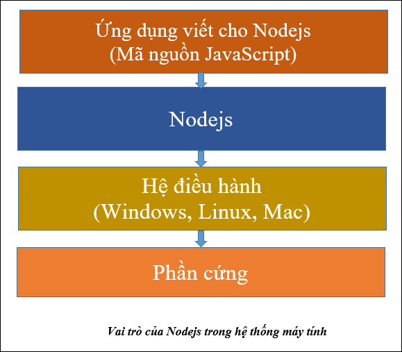
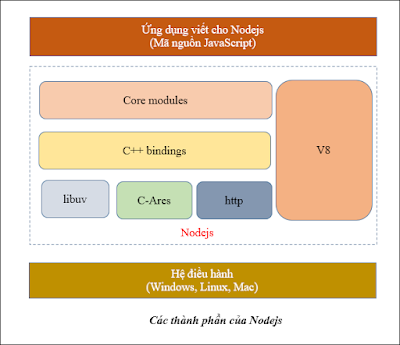
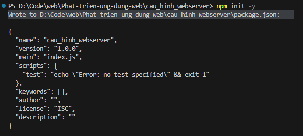
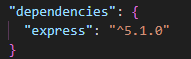

# Self note dành cho môn Phát triển ứng dụng web
## Giảng viên hướng dẫn: 
* Thầy Lê Gia Công
## Tác giả
* Ngô Bá Tài
## Chương 1: Web back-end
### 1.1 Một số khái niệm cơ bản
* **Web:** Web hay WWW là từ viết tắt của World Wide Web là mạng lưới thông tin toàn cầu. Web bao gồm rất nhiều các trang web kết nối lại với nhau, với thông tin đa dạng như văn bản, 
  hình ảnh, âm thanh, video và nhiều loại dữ liệu khác
* **Trang web(web page):** là một trang tài liệu trên hệ thống web. Trang web có thể chứa văn bản, hình ảnh, âm thanh, video, và các nội dung đa phương tiện khác.
  * Trang web được tạo ra bằng HTML, CSS, JavaScript và một trong các ngôn ngữ lập trình phía server(Python, JavaScript, C#, PHP, Go, Java, Ruby...)
  * Mã nguồn của trang web được lưu trên máy chủ (máy web server)
  * Mỗi trang web có một địa chỉ URL duy nhất. URL là một chuỗi ký tự, xác định vị trí của một trang web trên Internet
  * Trang web có thể được dùng để: cung cấp thông tin, bán hàng, chia sẻ ý kiến, kết nối mọi người, giáo dục, quản lý, giải trí
* **Website:** Website là một tập hợp nhiều trang web có liên quan đến nhau, có một địa chỉ URL duy nhất

* **Ứng dụng web (web application hay web app):** là một loại ứng dụng mà người dùng có thể truy cập và sử dụng thông qua Internet hoặc mạng nội bộ (hoặc trên máy cục bộ) bằng trình 
  duyệt web. Ví dụ: Google Drive
  * Một số đặc điểm:
      * Mã nguồn của ứng dụng web được để trên máy server, giao diện ứng dụng web được hiển thị trên trình duyệt
      * Ứng dụng web hoạt động dựa trên mô hình client-server
      * Không có sự phân biệt rõ ràng giữa website và ứng dụng web
  * Điểm khác nhau giữa Website và Ứng dụng web:
    
  
### 1.2 Phát triển ứng dụng web là gì?
Phát triển ứng dụng web là quá trình tạo ra ứng dụng web

Tạo ra ứng dụng web cũng là quá trình tạo ra ứng dụng máy tính hay phần mềm nói chung, vì vậy nó cũng cần trải qua các giai đoạn cơ bản như:
- Lập dự án

- Xác định yêu cầu

- Phân tích

- Thiết kế

- Lập trình

- Triển khai

- Bảo trì và cập nhật


#### 1.2.1 Một số cách để tạo ra ứng dụng web
- Sử dụng hệ quản trị nội dung

- Sử dụng framework và thư viện hỗ trợ

- Viết thuần bằng ngôn ngữ lập trình mà không sử dụng framework và thư viện hỗ trợ


* Hệ quản trị nội dung (Content Management System - CMS) là một phần mềm hoặc một tập hợp các phần mềm được sử dụng để tạo, quản lý và sửa đổi nội dung trên một trang web mà 
  không cần đến các kiến thức chuyên sâu về lập trình. Ví dụ: WordPress, Wix, Joomla, Drupal, Magento, Shopify, WordPress, Blogger...
  * Các chức năng chính của một CMS:
    - Tạo và quản lý nội dung: cho phép người dùng dễ dàng tạo, chỉnh sửa, xóa và sắp xếp nội dung (văn bản, hình ảnh, video) trên trang web

    - Quản lý người dùng: cho phép phân quyền truy cập và quản lý các tài khoản người dùng khác nhau, ví dụ: quản trị viên, nhân viên, biên tập viên, tác giả.

    - Quản lý giao diện: cho phép tùy chỉnh giao diện của trang web thông qua các mẫu giao diện (template), các kho giao diện (theme)

    - Quản lý các mô-đun, các tiện ích bổ sung: cho phép mở rộng chức năng của trang web thông qua việc cài đặt các mô-đun (module) hoặc các tiện ích bổ sung (plugin)

    - Tối ưu hóa SEO: hỗ trợ các công cụ và tính năng để tối ưu hóa công cụ tìm kiếm (SEO) cho trang web, giúp trang web dễ dàng được tìm thấy trên các công cụ tìm kiếm như Google
  * Ưu điểm của CMS:
    - Dễ sử dụng, dễ quản lý, tiết kiệm thời gian

    - Không cần kiến thức lập trình chuyên sâu

    - Linh hoạt trong việc lựa chọn giao diện, các mô-đun chức năng

    - Tối ưu SEO

    - Chi phí phát triển ứng dụng thấp
  * Nhược điểm của CMS:
    - Vấn đề bảo mật, tấn công hệ thống

    - Hiệu suất, tốc độ thực thi có thể chậm nếu không được tối ưu đúng cách; mã nguồn lớn, dư thừa

    - Khả năng tùy chỉnh chức năng thấp

    - Phụ thuộc hạ tầng, công nghệ, chức năng vào nhà cung cấp
* Frameword và thư viện hỗ trợ:
  - Frontend: jQuery, Bootstrap, D3, React, Angular, Vue, Svelte 

  - Backend: Express.js (Nodejs), Django, Flask (Python), ASP.NET (C#), Spring Boot (Java), Laravel (PHP), Ruby on Rails (Ruby), Gin, Echo (Go, Golang)
    
  - Ưu điểm khi sử dụng framework và thư viện:
      - Tăng tốc độ phát triển
      - Cải thiện chất lượng viết mã
      - Tăng cường bảo mật
      - Dễ dàng bảo trì và mở rộng
      - Cộng đồng hỗ trợ lớn
  - Nhược điểm của việc sử dụng framework:
    - Để sử dụng một framework hiệu quả, bạn cần phải dành thời gian để học và làm quen với nó

    - Một số framework có thể làm tăng kích thước của ứng dụng, các ứng dụng quá đơn giản thì không nhất thiết phải dùng framework

    - Một số framework có thể hạn chế khả năng tùy chỉnh của bạn
* Viết thuần: Việc phát triển ứng dụng web bằng cách tự viết mã từ đầu (hay còn gọi là "viết thuần”, “viết tay") cũng là một cách bạn có thể sử dụng để tạo ra ứng dụng web. Bạn sẽ không 
  sử dụng bất kì framework hay thư viện hỗ trợ nào. Các ngôn ngữ bạn sẽ sử dụng:
  - Frontend: HTML, CSS, JavaScript
  - Backend: một trong các ngôn ngữ lập trình: JavaScript, Python, C#, PHP, Java, Go, Ruby
  - Ưu điểm:
    - Toàn quyền kiểm soát và tùy chỉnh mã nguồn, không bị bất kì ràng buộc hay giới hạn nào

    - Tối ưu hóa mã nguồn để ứng dụng chạy nhanh và hiệu quả nhất

    - Hiểu rất sâu và nắm vững các ngôn ngữ lập trình, kỹ thuật lập trình, kỹ thuật bảo mật, công nghệ web

    - Tư duy logic và giải quyết vấn đề tố
  - Nhược điểm:
    - Tốn thời gian, công sức

    - Khối lượng công việc rất lớn

    - Yêu cần kiến thức chuyên môn cao, toàn diện

    - Khó bảo trì và mở rộng

    - Chi phí cao
### 1.3 Web Server
Web server (máy chủ web) là một máy tính (hoặc một phần mềm), được sử dụng để lưu trữ và cung cấp toàn bộ nội dung cho một website/ứng dụng web (tạm gọi chung là ứng dụng web).
Một số chức năng chính của web server
- Lưu trữ các tập tin của ứng dụng web: web server lưu trữ tất cả các tập tin và dữ liệu tạo nên ứng dụng web, ví dụ các tập tin HTML, hình ảnh và video.

- Nhận yêu cầu (request): khi người dùng truy cập một ứng dụng web, trình duyệt web của họ sẽ gửi một request tới web server. Web server sẽ tiếp nhận request này.

- Xử lý request: sau khi nhận được request, web server sẽ thực hiện xử lý request. Việc xử lý request có thể là: đọc nội dung các tập tin, thực thi các đoạn mã nguồn, kết nối và làm việc với cơ sở dữ liệu.

- Gửi phản hồi (response): sau khi xử lý xong request, web server sẽ gửi response cho trình duyệt của người dùng, sau đó, trình duyệt sẽ hiển thị kết quả response cho người dùng

* Một số phần mềm web server phổ biến: Apache, Nginx, NodeJS, IIS, Tom cat, Lighttpd
* Kiến trúc của 1 web server
  


* Một máy web server có các đặc điểm sau:

  - Phần cứng là một máy server chuyên dụng, cấu hình mạnh, khả năng chịu lỗi cao, chạy liên tục

  - Hệ điều hành dành cho máy chủ

  - Có cài đặt phần mềm web server (HTTP server - Apache, Nginx, IIS), có thể có hệ quản trị cơ sở dữ liệu (Database), trình dịch và thực thi mã nguồn (Scripting Language)
#### 1.3.1 Nginx
Nginx là phần mềm web server mã nguồn mở
* Một số lệnh quan trọng của nginx
- start nginx: khởi chạy Nginx 

- nginx -s stop: tắt Nginx ngay lập tức

- nginx -s quit: không chấp nhận kết nối mới, chờ các client hoàn thành tác vụ dang dở rồi mới tắt Nginx

- nginx -s reload: thay đổi cấu hình, khởi chạy lại worker process với cấu hình mới

- nginx -s reopen: mở lại các tập tin log
### 1.4 NodeJS và NPM
#### 1.4.1 NodeJS là gì?
Nodejs là một môi trường để chạy mã nguồn JavaScript đa nền tảng, mã nguồn mở, miễn phí. Bạn có thể dùng Nodejs để tạo server (web server), ứng dụng web, các công cụ dòng lệnh và các ứng dụng khác.

Là một lập trình viên, bạn sẽ lập trình một ứng dụng bằng ngôn ngữ JavaScript thuần hoặc dùng một JavaScript framework (ví dụ Express), sau đó chuyển mã nguồn cho Nodejs dịch mã, thực thi chương trình, xuất kết quả


#### 1.4.2 Các thành phần của NodeJS


- V8 để dịch và thực thi mã JavaScript

- HTTP module để tạo web server (hay còn gọi là HTTP server)

- Chương trình để quản lý gói và các thư viện có tên là NPM

- Các module, thư viện để lập trình ứng dụng web
#### 1.4.3 NPM
Vì số lượng các thư viện cần tải trong quá trình phát triển web là rất nhiều nên không thể quản lý thủ công mà cần tới phần mềm để quản lý. NPM chính là công cụ để quản lý các thư viện mà chúng ta sử dụng khi làm ứng dụng web.

NPM (Node Package Manager) là công cụ đi kèm với Nodejs, được sử dụng để quản lý các thư viện dùng trong ứng dụng web.

NPM gồm 3 thành phần

- Website: địa chỉ là https://www.npmjs.com/, bạn vào trang này để tìm kiếm các gói thư viện cần dùng

- Công cụ dòng lệnh (Command Line Interface - CLI): lập trình viên sử dụng công cụ này để tương tác với npm, để cài đặt, sử dụng và quản lý các thư viện

- Registry: là kho lưu trữ các thư viện
### 1.5 Cấu hình web server trong NodeJS
#### 1.5.1 Package.json
Trong một ứng dụng viết trên Nodejs, tập tin package.json cũng đóng vai trò như một cuốn sổ tay, là “sổ tay ứng dụng”, cũng có thể gọi là “hồ sơ ứng dụng” (manifest)
Tập tin package.json chứa thông tin sau:
  - Thông tin mô tả về ứng dụng

  - Quản lý các phụ thuộc (quản lý các thư viện sử dụng trong ứng dụng)

  - Các lệnh chạy (scripts), định nghĩa ngắn gọn các lệnh để điều khiển ứng dụng

  - Đầu vào (entry point, main) của dự án, cho biết tập tin đầu tiên được triệu gọi

Dùng NPM để tạo ra file package.json (sử dụng terminal của vs code cho tiện)
  * B1: Mở terminal của vscode và trỏ tới thư mục dự án
  * B2: Chạy lệnh npm init -y (Nếu có kết quả như ảnh thì là đúng)

* Lệnh npm init -y: được sử dụng để khởi tạo một dự án Node.js mới với file package.json mà không cần phải trả lời các câu hỏi cấu hình thủ công. Nếu không có tham số -y thì sẽ hiện một 
  loạt các câu hỏi về thông tin dự án (như tên dự án, phiên bản, mô tả, tác giả...). Tùy chọn -y là viết tắt của yes, khi có tùy chọn này thì npm sẽ tự động điền các giá trị mặc định 
  cho tất cả các câu hỏi này và tạo ngay tập tin package.json mà không yêu cầu sự can thiệp của bạn.
#### 1.5.2 Cài đặt PNPM, Express, Web server, Nodemon
* Cài đặt PNPM(Performant Node Package Manager):
  Gõ lệnh: ```npm install -g pnpm@latest-10```
  - npm install: lệnh của npm, dùng để cài đặt các gói, thư viện, công cụ
  
  - g: tham số global (cài đặt ở phạm vi toàn cục)
    
  - pnpm: tên công cụ cần cài đặt
    
  - @latest-10: phiên bản mới nhất của bản 10-x
* Cài đặt Express:
  Gõ lệnh trong terminal của vscode: ```pnpm i -s express```
  - i có nghĩa là cài đặt (install)
    
  - s là viết tắt của --save, với tùy chọn này, thông tin của Express sẽ được thêm vào phần dependencies trong package.json, thư viện Express sẽ được lưu trong thư mục node_modules của 
  dự án.

  - Sau khi cài được Express, mở tập tin package.json, sẽ thấy thông tin của Express được lưu trong phần dependencies. Trong thư mục dự án cũng xuất hiện thêm thư mục 
  node_modules. Thư mục node_modules này dùng để lưu trữ các gói mà dự án sẽ sử dụng. Như vậy, Express cũng được lưu trong node_modules.

* Tạo file index.js và khai báo như sau để tạo web server:
```
'use strict'
const express = require('express')
const app = express();
const port =
process.env.PORT || 9000
// xu ly khi nguoi dung gui request toi web server
app.get("/", (req, res) => {
    res.send('Chao ban den voi TeoShop!!');
})
// khoi dong web server
app.listen(port, () => {
    console.log(`server dang chay tren cong ${port}`);
})
```
Sau đó sử dụng lệnh node index.js để khởi chạy web server, để tắt web server, chuyển dấu nhắc chuột vào cửa sổ dòng lệnh, dùng tổ hợp phím Ctrl + C.
* Cài đặt Nodemon:
Trong quá trình làm việc với web server, mỗi lần thay đổi mã nguồn của tập tin (index.js), chúng ta đều phải tắt web server (Ctrl + C), và chạy lại. Mục đích để web server cập nhật lại mã nguồn. Điều này khá bất tiện.

Sử dụng câu lệnh để cài đặt: ```npm install --g nodemon```

Vào terminal gõ: ```nodemon``` (Thay vì dùng lệnh node index.js thì gõ nodemon mỗi lần chạy web server)
### 1.5.3 Thông tin thêm
* Vậy package.json và node_modules khác nhau như nào?
  * package.json là một file mô tả dự án với mục đích chính là lưu thông tin về project, thư viện và ứng dụng
  * node_modules là một thư mục chứa code thư viện (Nơi chứa mã nguồn của các package đã cài qua npm)
* Làm sao biết được một gói cài đặt ở chế độ cục bộ (locally) hay toàn cục (globally)? Khi cài đặt các gói (package) ở chế độ cục bộ và toàn cục (globally) thì các gói sẽ được lưu ở 
  đâu?
  * Làm sao biết được một gói cài đặt ở chế độ cục bộ (locally) hay toàn cục (globally): Trong câu lệnh cài đặt có quy ước -g (Cài đặt global) còn nếu không có thì mặc định là local
  * Khi cài đặt các gói (package) ở chế độ cục bộ và toàn cục (globally) thì các gói sẽ được lưu ở đâu: Cài đặt cục bộ thì sẽ lưu trong node_modules còn cài đặt toàn cục thì lưu trong     thư mục golbal của npm
### 1.6 Local và Global, Dependencies và devDependencies
#### 1.6.1 Local và Global
* Cài đặt gói kiểu cục bộ
  Sử dụng cú pháp '''npm install <package_name>'''
  
  Sau khi cài đặt xong thì thông tin về gói này sẽ được ghi lại trong tập tin package.json, mục dependencies

  Khi một gói được cài đặt theo kiểu cục bộ, mã nguồn của gói sẽ được lưu trong dự án, tại thư mục node_modules.
* Gỡ bỏ một gói cục bộ
  Dùng lệnh ```npm uninstall <package_name>``` để gỡ cài đặt 1 gói cục bộ

  Sau khi gỡ bỏ gói, mục dependencies trong package.json cũng được cập nhật lại.
* Cài đặt một gói kiểu toàn cục (global)
  Dùng lệnh ```npm install <package_name> -g``` -g là viết tắt của global
* Vị trí lưu trữ gói toàn cục
  Dùng lệnh ```npm root -g``` để biết được vị trí lưu trữ các gói toàn cục

  Dùng lệnh ```npm ls -g --depth 0``` để xem được các gói toàn cục đã cài đặt
  - npm ls: để liệt kê các gói đã được cài đặt trên máy, ls là viết tắt của list

  - -g là cờ báo, để chỉ hiển thị các gói kiểu toàn cục (global)

  -  --depth 0: chỉ hiển thị các gói toàn cục cấp cao nhất
  (top-level), không hiển thị các gói là con-cháu (sub-dependencies) của gói cấp cao nhất
* Nên cài đặt gói theo kiểu cục bộ hay toàn cục
  * Các trường hợp nên cài gói cục bộ:
  - Khi gói chỉ cần thiết cho một dự án cụ thể và không cần sử dụng ở phạm vi rộng hơn

  - Khi bạn muốn các phụ thuộc (dependencies) của dự án được quản lý chặt chẽ trong tập tin package.json, giúp dễ dàng tái tạo môi trường phát triển ở máy khác (ví dụ: khi chia sẻ mã       nguồn hoặc triển khai)
  
  - Khi gói là một phần của ứng dụng hoặc thư viện mà bạn đang phát triển (ví dụ: express)
  * Các trường hợp nên cài gói toàn cục:
  - Khi gói là công cụ dòng lệnh (CLI) hoặc tiện ích mà bạn muốn sử dụng ở bất kỳ đâu trong hệ thống, không phụ thuộc vào dự án cụ thể (ví dụ: nodemon)

  - Khi bạn cần chạy gói như một lệnh độc lập từ cửa sổ dòng lệnh mà không cần viết script trong package.json

  * Một số lưu ý
  * Ưu tiên cài cục bộ khi có thể: ngay cả với các công cụ dòng lệnh như eslint hay prettier, bạn vẫn có thể cài cục bộ và chạy chúng thông qua script trong package.json. Điều này giúp     đảm bảo mọi thành viên trong nhóm hoặc môi trường CI/CD sử dụng cùng phiên bản
  * Khi nào cần cả hai? Đôi khi bạn muốn cài toàn cục để tiện sử dụng cá nhân, nhưng vẫn cài cục bộ cho dự án để đảm bảo tính nhất quán
  * Tránh lạm dụng cài toàn cục: chỉ nên cài toàn cục cho các công cụ thực sự cần thiết ở phạm vi hệ thống. Việc cài quá nhiều gói toàn cục có thể dẫn đến khó quản lý và xung đột phiên    bản.
#### 1.6.2 Dependencies và devDependencies
Chỉ có các gói được cài đặt theo kiểu **cục bộ (trong dự án)**, thì mới được cập nhật thông tin trong package.json, trong mục dependencies và devDependencies.

Như vậy, dependencies và devDependencies là hai phần trong tập tin package.json, dùng để quản lý các gói mà dự án của bạn phụ thuộc vào. Sự khác biệt giữa chúng nằm ở mục đích sử dụng và giai đoạn mà chúng được yêu cầu trong vòng đời của dự án

##### a) Các gói nằm trong mục dependencies
Là các gói cần thiết để ứng dụng của bạn chạy trơn tru trong môi trường sản xuất, triển khai (production). Đây là những phụ thuộc "cốt lõi" mà mã nguồn của bạn trực tiếp sử dụng để hoạt động.

- Là một phần không thể thiếu trong xử lý logic của ứng dụng, ví dụ: framework express, thư viện xử lý HTTP, truy vấn cơ sở dữ liệu

- Khi người khác cài đặt dự án của bạn bằng lệnh npm install, các gói trong dependencies sẽ được tải về, vì chúng cần thiết để chạy ứng dụng

**Cách cài đặt một gói là dependencies**
Dùng lệnh ```npm install <package-name>```
##### b) Các gói nằm trong mục devDependencies
- Là các gói chỉ cần thiết trong quá trình phát triển ứng dụng (development) hoặc kiểm thử (testing), không cần thiết khi ứng dụng chạy ở môi trường sản xuất, triển khai (production)

- Khi gói là công cụ hỗ trợ lập trình viên, như công cụ kiểm tra cú pháp (linter), trình biên dịch (transpiler), framework kiểm thử (testing framework), hoặc công cụ khởi động server trong lúc thử nghiệm (nodemon)

- Khi cài đặt ứng dụng lên môi trường triển khai (production), các gói trong devDependencies sẽ không được cài đặt, giúp giảm dung lượng và tăng hiệu suất

**Cách cài đặt một gói là devDependencies**
Dùng lệnh ```npm install <package-name> --save-dev```
### 1.7 Một số chủ đề JavaScript
#### 1.7.1 Lập trình đồng bộ trong JavaScript
Lập trình đồng bộ (synchronous programming) là kỹ thuật lập trình mà các lệnh (statements) được thực thi tuần tự, theo thứ tự từ trên xuống dưới. Mỗi lệnh phải hoàn thành trước khi lệnh tiếp theo được thực thi

* Đặc điểm:
  - Thứ tự thực thi rõ ràng: các lệnh chạy theo thứ tự được viết trong mã nguồn

  - Chặn luồng (blocking): một lệnh chưa xong thì lệnh tiếp theo không thể chạy

  - Phù hợp với tác vụ đơn giản: các tác vụ không cần chờ đợi (như tính toán cơ bản) thường được xử lý đồng bộ
* Ưu điểm:
  - Dễ hiểu và dễ debug
  - Phù hợp với tác vụ nhanh
* Nhược điểm:
  - Gây chặn luồng (blocking)
  - Không hiệu quả cho các tác vụ I/O
  - Không tận dụng được khả năng xử lý song song
  - Không thích hợp cho ứng dụng lớn hoặc real time
#### 1.7.2 Hàm ẩn danh
Hàm ẩn danh (anonymous function) là một hàm không có tên (không được đặt tên) khi định nghĩa. Thay vì khai báo với từ khóa function đi kèm với tên như hàm thông thường, hàm ẩn danh thường được gán trực tiếp vào biến, truyền làm tham số, hoặc thực thi ngay lập tức mà không cần gọi hàm.

* Đặc điểm:
  - Không có tên: được định nghĩa mà không cần đặt tên sau từ khóa function

  - Tính linh hoạt: thường được dùng ngay tại nơi khai báo hoặc gán vào biến

  - Phạm vi: có thể truy cập biến trong phạm vi bao quanh (closure)
    
  - Không hoisting: không được "nâng lên" (hoisted) như hàm khai báo (function declaration)
* Cú pháp
  Hàm ẩn danh thông thường
  ```
  function() {
    // thân hàm
  }
  ```
  Hàm ẩn danh kiểu mũi tên
  ```
  () => {
    // thân hàm
  }
  ```
* Ví dụ: **nằm trong file dongbo.js**
* Hạn chế:
  - Khó gỡ lỗi (debug); vì không có tên, việc xác định lỗi trong stack trace có thể khó khăn hơn.
  - Không tái sử dụng được: nếu cần dùng lại, bạn phải gán nó cho một biến hoặc đặt tên
#### 1.7.3 Hàm mũi tên
Hàm mũi tên là một tính năng quan trọng được giới thiệu trong ES6 (ECMAScript 2015). Đây là cách viết hàm ngắn gọn và hiện đại trong JavaScript, thường được dùng trong lập trình bất đồng bộ và các tình huống khác.

* Đặc điểm:
  - Cú pháp ngắn gọn: do loại bỏ từ khóa function, dấu {} và lệnh return trong một số trường hợp

  - Không có this (ngữ cảnh) riêng: this trong hàm mũi tên được kế thừa từ phạm vi bên ngoài (lexical scoping), không bị ràng buộc (bound) như hàm thông thường

  - Không có arguments: không tự động tạo biến arguments để truy cập danh sách tham số

  - Không thể dùng làm hàm tạo (constructor): không thể gọi với từ khóa new để tạo đối tượng
* Cú pháp:
  - Không tham số: () => { ... }

  - Một tham số: x => { ... } (không cần dấu ngoặc cho một tham số)

  - Nhiều tham số: (x, y) => { ... }
* Ví dụ: **Trong file hammuiten.js**
* Từ khóa this trong hàm mũi tên
Hàm mũi tên không tạo this (biến ngữ cảnh) riêng, mà lấy this từ phạm vi bao quanh.
```
function Person() {
    this.age = 0;
    setInterval(() => {
        this.age++; // 'this' tham chiếu đến đối tượng Person
        console.log(this.age);
    }, 1000);
}

const p = new Person(); // Kết quả: 1, 2, 3, ... (tăng mỗi giây)
```
#### 1.7.4 Lập trình bất đồng bộ
Trong JavaScript, lập trình bất đồng bộ (asynchronous programming) là một mô hình lập trình cho phép chương trình thực hiện nhiều tác vụ cùng lúc mà không cần chờ đợi tác vụ trước đó hoàn thành. Điều này đặc biệt hữu ích khi xử lý các tác vụ tốn thời gian như yêu cầu xử lý qua mạng (gọi API, giao tiếp client-server), đọc/ghi tập tin hoặc tương tác với cơ sở dữ liệu

* Các kỹ thuật lập trình bất đồng bộ:
  * Callback:
    - Đây là cách tiếp cận truyền thống để xử lý bất đồng bộ trong JavaScript.
    - Một callback là một hàm được truyền vào một hàm khác và được thực thi khi tác vụ bất đồng bộ hoàn thành.
    - Tuy nhiên, sử dụng quá nhiều callback có thể dẫn đến "callback hell", khiến mã nguồn trở nên khó đọc và khó bảo trì.
  * Promises:
    - Promises là một đối tượng đại diện cho kết quả cuối cùng của một tác vụ bất đồng bộ.
    - Chúng cung cấp một cách viết mã bất đồng bộ rõ ràng và dễ bảo trì hơn so với callback.
    - then() được sử dụng khi thực hiện thành công, catch() được sử dụng khi gặp lỗi.
  * Async/await:
    - Async/await là một cú pháp mới hơn để viết mã bất đồng bộ, được giới thiệu trong ES2017.

    - Nó cho phép bạn viết mã bất đồng bộ trông giống như mã đồng bộ, giúp mã trở nên dễ đọc và dễ hiểu hơn.

    - async được đặt trước function, await được đặt trước các lời gọi hàm bất đồng bộ.
### 1.8 Callback
Hàm callback là một hàm được truyền vào một hàm khác như một tham số, và sẽ được thực thi sau khi hàm "cha" hoàn thành một tác vụ nào đó. Nói một cách đơn giản, nó là một cách để đảm bảo một đoạn mã được thực thi sau khi một đoạn mã khác hoàn thành.
* Các đặc điểm của hàm callback:
  - Truyền như tham số: callback là một hàm được truyền vào hàm khác để thực thi sau khi một điều kiện hoặc tác vụ hoàn tất.
  - Thực thi bất đồng bộ: thường dùng để xử lý các tác vụ không chặn luồng chính (non-blocking), như truy cập thiết bị (đọc/ghi tập tin), gọi API, hoặc trong các hàm hẹn giờ (timer).
  - Tính linh hoạt: có thể là hàm ẩn danh (anonymous function), hàm mũi tên (arrow function), hoặc hàm đã được định nghĩa trước (function expression).
  - "Callback Hell": nếu lồng quá nhiều callback, mã nguồn có thể trở nên khó đọc và bảo trì. Callback hell thường được giải quyết bằng Promise hoặc async/await.
* Một số tình huống có thể sử dụng hàm Callback:
  - Xử lý sự kiện (event handling): gắn hàm callback để phản hồi hành động của người dùng (ví dụ: click, hover, submit).
  - Tác vụ bất đồng bộ: gọi API, đọc/ghi tập tin, hoặc sử dụng trong các hàm hẹn giờ (ví dụ: setTimeout, setInterval).
  - Xử lý mảng: sử dụng trong các phương thức như forEach, map, filter, reduce.
  - Hoàn thành tác vụ: đảm bảo một đoạn mã chạy sau khi tác vụ khác hoàn tất (ví dụ: tải dữ liệu từ server rồi hiển thị lên giao diện).
  - Tùy chỉnh logic: cho phép người dùng truyền logic riêng vào hàm tổng quát.
* Ví dụ: **Trong file HamCallBack.js**
* Nhược điểm của hàm callback
  - Callback Hell: lồng quá nhiều callback dẫn đến mã khó đọc.
  - Xử lý lỗi phức tạp: cần kiểm tra lỗi thủ công trong mỗi callback.
  - Không trực quan: với các luồng phức tạp, khó theo dõi thứ tự thực thi.
## Chương 2: Git thực hành
### 2.1 Hệ thống quản lý phiên bản
* **Phiên bản(version):** là các bản khác nhau của tập tin, thư mục hoặc toàn bộ mã nguồn dự án (từ đây gọi chung là dự án để tiện trình bày)
* **Hệ thống quản lý phiên bản (Version Control System - VCS):** một phần mềm giúp chúng ta lưu lại từng thay đổi của mã nguồn dự án, và giúp lấy lại được các phiên bản trước đó nếu 
  cần.
  * Các chức năng chính:
    - Khôi phục lại trạng thái của dự án ở các thời điểm khác nhau trong quá khứ
    - Biết được ai đã thực hiện các thay đổi trên dự án, và đã thay đổi những gì
    - Dễ dàng khôi phục lại các nội dung mã nguồn bị xóa 
    - Dễ dàng so sánh những thay đổi của dự án theo các mốc thời gian
  * Phân loại:
    - Hệ thống quản lý phiên bản cục bộ
    - Hệ thống quản lý phiên bản tập trung
    - Hệ thống quản lý phiên bản phân tán
#### 2.1.1 Hệ thống quản lý phiên bản cục bộ
phương pháp tự lưu trữ các phiên bản của thư mục dự án ở các thời điểm khác nhau trong quá trình làm việc thành các tên khác nhau. 


* Ưu điểm:
  * Hiệu suất nhanh
  * Tự kiểm soát dữ liệu
  * Dễ quản lý
  * Làm việc offline
* Nhược điểm:
  * Không hỗ trợ làm việc nhóm
  * Không có backup tự động
  * Khó kiểm soát khi số lượng phiên bản lớn
#### 2.1.2 Hệ thống quản lý phiên bản tập trung
Gồm máy chủ chứa các phiên bản của thư mục dự án và danh sách các máy khách được phép thay đổi thư mục dự án trên máy chủ. Các máy khách sẽ lấy các phiên bản của thư mục dự án từ máy chủ về, thực hiện các thay đổi trên thư mục dự án và cập nhật lại các thay đổi về máy chủ


* Ưu điểm:
  * Dễ quản lý tập trung
  * Hỗ trợ làm việc nhóm
  * Phân quyền dễ dàng
  * Nhật ký thay đổi rõ ràng
  * Dung lượng máy client nhẹ
* Nhược điểm:
  * Phụ thuộc lớn vào server
  * Phụ thuộc vào mạng
  * Không làm việc offline
#### 2.1.3 Hệ thống quản lý phiên bản phân tán
Các máy client không chỉ lấy thư mục mới nhất như **hệ thống quản lý phiên bản tập trung** mà nó còn chép toàn bộ cả kho chứa (repository, repo), trong đó bao gồm cả lịch sử các phiên bản


* Ưu điểm:
  * Mỗi client đều có bản sao đầy đủ
  * Làm việc offline dễ dàng
  * Bảo mật và an toàn cao
  * Quản lý nhánh mạnh mẽ
  * Hiệu suất cao khi làm việc nhóm
* Nhược điểm:
  * Tốn dung lượng máy client
  * Cần cấu hình remote hợp lý
  * phụ thuộc vào tool khi merge
### 2.2 Tổng quan về git
#### 2.2.1 Git là gì?
Git là một hệ thống quản lý phiên bản phân tán (distributed version control system) được sử dụng rộng rãi trong phát triển phần mềm. Nó cho phép các nhóm lập trình viên theo dõi và quản lý các thay đổi trong mã nguồn của một dự án một cách hiệu quả

Một số tính năng của Git:
- Theo dõi lịch sử thay đổi: Git lưu lại từng thay đổi nhỏ nhất của mã nguồn, giúp bạn dễ dàng quay lại các phiên bản trước đó nếu cần

- Cộng tác hiệu quả: Git cho phép nhiều người cùng làm việc trên một dự án cùng lúc, đồng thời hợp nhất các thay đổi một cách dễ dàng

- Phân nhánh và hợp nhất: Git hỗ trợ tạo nhiều nhánh (branch) làm việc độc lập, giúp bạn thử nghiệm các tính năng mới mà không ảnh hưởng đến phần còn lại của dự án

- Bảo mật: Git lưu trữ các thay đổi dưới dạng các bản ghi (commit) không thể thay đổi, đảm bảo tính toàn vẹn của mã nguồn

- Phân tán: mỗi bản sao của một kho lưu trữ Git đều là một kho lưu trữ đầy đủ, cho phép bạn làm việc không cần kết nối mạng và đồng bộ hóa sau đó (khi có kết nối mạng)
#### 2.2.2 Nhúng Git vào dự án
Mặc dù Git đã được tích hợp vào các phần mềm lập trình (ví dụ Visual Studio, Eclipse, VS code). Tuy nhiên, cách học Git hiệu quả nhất vẫn là sử dụng giao diện dòng lệnh. Giao diện dòng lệnh chứa đầy đủ nhất các lệnh của Git, khi đã hiểu được bản chất các lệnh rồi thì chuyển sang sử dụng các giao diện khác rất đơn giản.

Các bước nhúng Git vào dự án:
* B1: Di chuyển vào thư mục dự án bằng lệnh cd trong CLI
* B2: Gõ lệnh git init (Nếu thành công thì sẽ hiện thông báo "initialized empty Git repository in [Path của ban]")
* B3: Quan sát sự thay đổi của thư mục dự án (Có thêm thư mục .git - Đây chính là kho chứa (kho lưu trữ) mà phần mềm Git thêm tạo ra trong thư mục dự án để sử dụng cho các tác vụ của nó)

## Chương 3: Trắc nghiệm
Câu 1.3: Phát biểu nào không đúng khi nói về web, trang web và website?

A. Web là hệ thống thông tin toàn cầu

B. Web được tạo thành nhờ các trang web và sự liên kết giữa chúng

**C. Một trang web chứa nhiều website**

D. Một website chứa nhiều trang web có liên quan đến nhau

Câu 1.4: Phát biểu nào không đúng khi nói về website và ứng dụng web?

A. Không có sự phân biệt rõ ràng giữa website và ứng dụng web

B. Một website và ứng dụng web có một địa chỉ URL để truy cập

C. Website và ứng dụng web hoạt động dựa trên mô hình client-server

**D. Chỉ cần sử dụng HTML và CSS là có thể tạo ra được ứng dụng web**

2. Phát triển ứng dụng Web

Câu 2.3: Có 3 cách để tạo ra một ứng dụng web? Phát biểu nào không đúng?

A. Sử dụng CMS

B. Sử dụng framework và thư viện hỗ trợ

C. Viết thuần bằng ngôn ngữ lập trình mà không sử dụng framework, thư viện hỗ trợ

**D. Sử dụng trình duyệt web**

Câu 2.4: Những ưu điểm khi sử dụng CMS để tạo ra ứng dụng web. Phát biểu nào không đúng?

**A. Cần kiến thức lập trình chuyên sâu**

B. Tối ưu SEO

C. Dễ sử dụng, dễ quản lý, tiết kiệm thời gian

D. Chi phí phát triển ứng dụng thấp

Câu 2.5: Những ưu điểm khi sử dụng framework và thư viện để tạo ra ứng dụng web. Phát biểu nào không đúng?

A. Tăng tốc độ phát triển

B. Cải thiện chất lượng viết mã

**C. Giảm khả năng bảo mật**

D. Dễ dàng bảo trì và mở rộng

Câu 3.2: Một số phần mềm web server phổ biến. Phát biểu nào không đúng?

A. Apache

B. Nginx

**C. SSI**

D. Node.js

Câu 3.3: Các chức năng của Web server là gì? Phát biểu nào không đúng?

A. Lưu trữ các tập tin của ứng dụng web

B. Nhận request từ client

C. Xử lý request

**D. Nhận response từ máy client**

4.2 Lệnh nào được sử dụng để nhúng Git vào thư mục dự án?

**A. git init**

B. git --init

C. git initialize

D. git embed

4.3 Lệnh nào sử dụng để kiểm tra trên máy tính đã có phần mềm Git hay chưa?

A. git ver

B. git version

**C. git --version hoặc git -v**

D. git --ver

4.4 Trong Git, kho lưu trữ (repo, repository) là gì?

A. Là thư mục dự án

B. Là thư mục dự án đã được nhúng Git

C. Là thư mục cài đặt phần mềm Git

**D. Là thư mục .git (trong thư mục dự án)**

4.5 Bạn có thể sử dụng các công cụ sau để viết mã. Phát biểu nào không đúng?

A. Text editor

**B. MS Word**

C. IDE, Code Editor

D. Chatbot (Gemini), Trang web (https://codepen.io/) 

Câu 1.1 Các đặc điểm của hệ thống quản lý phiên bản cục bộ. Phát
biểu nào không đúng?

A. Có thể thực hiện thủ công

B. Không hỗ trợ trong môi trường cộng tác nhiều người

C. Có thể dùng phần mềm để quản lý phiên bản kiểu cục bộ

**D. Các phiên bản của dự án được lưu tập trung trên một máy server**

Câu 1.2 Các đặc điểm của hệ thống quản lý phiên bản tập trung.
Phát biểu nào không đúng?

A. Các phiên bản của dự án được lưu tập trung trên máy server

**B. Các máy client sẽ chứa tất cả các phiên bản của thư mục dự án
cùng với lịch sử thay đổi** 

C. Máy client không thể tải phiên bản của dự án về, khi máy server
không hoạt động

D. Hỗ trợ làm việc cộng tác nhiều người

Câu 1.3 Các đặc điểm của hệ thống quản lý phiên bản phân tán. Phát
biểu nào không đúng?

A. Các máy client sẽ chứa toàn bộ các phiên bản của dự án, cùng
lịch sử thay đổi

B. Hỗ trợ làm việc cộng tác nhiều người

C. Các phiên bản của dự án được lưu trên máy server

**D. Bạn không thể tạo và lưu phiên bản khi không có kết nối mạng
tới máy server**

Câu 5.2 Nodejs là gì? Phát biểu nào không đúng?

A. Nodejs là môi trường phát triển ứng dụng

**B. Nodejs là một ngôn ngữ lập trình**

C. Nodejs là nền tảng phát triển ứng dụng

D. Có thể sử dụng Nodejs để tạo web server

Câu 5.3 NPM là gì? Phát biểu nào không đúng?

A. NPM là viết tắt của Node Package Manager

B. NPM là công cụ để quản lý các thư viện dùng trong một ứng dụng chạy trên nền Nodejs

C. NPM được cài đặt mặc định khi cài đặt Nodejs

**D. NPM gồm 3 thành phần: website, GUI và registry**

Câu 6.4 Trong ứng dụng chạy trên nền Nodejs, tập tin package.json dùng để làm gì? Phát biểu nào không đúng?

A. Chứa thông tin mô tả về ứng dụng

B. Quản lý các phụ thuộc

C. Chỉ ra tập tin JavaScript đầu tiên được thực thi

**D. Chứa mã để tạo giao diện ứng dụng**

Câu 6.5 PNPM là gì? Phát biểu nào không đúng?

A. Giúp tiết kiệm dung lượng đĩa

B. Có thể thay thế hoặc bổ sung cho NPM

C. Là viết tắt của Performant Node Package Manager 

**D. Không thể thay thế hoặc bổ sung cho NPM**

Câu 6.6 Express trong Node.js được sử dụng để làm gì?

**A. Tạo ứng dụng web và API**

B. Quản lý cơ sở dữ liệu

C. Thiết kế giao diện người dùng

D. Kiểm tra hiệu suất ứng dụng

Câu 6.7 Nodemon trong Node.js được sử dụng để làm gì?

A. Kết nối với cơ sở dữ liệu

B. Tạo giao diện người dùng cho ứng dụng

C. Quản lý các gói phụ thuộc

**D. Tự động khởi động lại server khi mã thay đổi**

Câu 7.2 Trong môi trường phát triển ứng dụng Nodejs, phát biểu nào không đúng khi nói về gói cục bộ?

A. Gói cục bộ được cài đặt trong thư mục node_modules của dự án

B. Gói cục bộ chỉ có thể được sử dụng trong dự án mà nó được cài đặt

C. Gói cục bộ được quản lý thông qua file package.json và có thể sử dụng các phiên bản khác nhau giữa các dự án

**D. Gói cục bộ luôn được cài đặt toàn cục trên hệ thống để tất cả các dự án đều có thể truy cập**

Câu 7.3 Trong môi trường phát triển ứng dụng Nodejs, phát biểu nào không đúng khi nói về gói toàn cục?

**A. Gói toàn cục luôn được liệt kê trong tập tin package.json của dự án**

B. Gói toàn cục thường được sử dụng cho các công cụ dòng lệnh (CLI) như nodemon

C. Gói toàn cục được lưu trong thư mục toàn cục của hệ thống và có thể truy cập từ bất kỳ dự án nào

D. Gói toàn cục được cài đặt bằng lệnh npm install -g <package-name>

Câu 7.4 Trong môi trường phát triển ứng dụng Nodejs, phát biểu nào không đúng khi nói về kiểu cài đặt dependencies?

A. Các gói trong dependencies được cài đặt cục bộ trong dự án bằng lệnh npm install <package-name>

B. Các gói trong dependencies là các phụ thuộc cần thiết để ứng dụng chạy trong môi trường triển khai, sản xuất (production)

**C. Các gói trong dependencies chỉ được sử dụng trong giai đoạn phát triển và không cần thiết khi triển khai ứng dụng (production)**

D. Các gói trong dependencies được liệt kê trong tập tin package.json và tự động cài đặt khi chạy npm install

Câu 7.5 Trong môi trường phát triển ứng dụng Nodejs, phát biểu nào không đúng khi nói về kiểu cài đặt devDependencies?

A. Các gói trong devDependencies được cài đặt bằng lệnh npm install <package-name> --save-dev

**B. Các gói trong devDependencies là các phụ thuộc cốt lỗi để ứng dụng chạy trong môi trường triển khai (production)**

C. Các gói trong devDependencies chỉ cần thiết trong giai đoạn phát triển hoặc kiểm thử, không cần cho môi trường triển khai (production)

D. Các gói trong devDependencies không được cài đặt khi chạy npm install --production

Câu 8.2: Lập trình đồng bộ trong JavaScript là gì? Phát biểu nào sau đây không đúng?

**A. Lập trình đồng bộ không chặn luồng, cho phép các lệnh tiếp theo chạy ngay cả khi tác vụ chưa hoàn tất.**

B. Các lệnh được thực thi tuần tự, theo thứ tự từ trên xuống dưới.

C. Mỗi lệnh phải hoàn thành trước khi lệnh tiếp theo được thực thi.

D. Phù hợp với các tác vụ đơn giản như tính toán cơ bản không cần chờ đợi.

Câu 8.3: Hàm ẩn danh (anonymous function) trong JavaScript là gì? Phát biểu nào sau đây không đúng?

A. Hàm ẩn danh có thể truy cập biến trong phạm vi bao quanh nhờ closure.

B. Hàm ẩn danh là hàm không có tên khi được định nghĩa.

C. Hàm ẩn danh thường được gán vào biến hoặc truyền làm tham số cho hàm khác.

**D. Hàm ẩn danh được "nâng lên" (hoisted) giống như hàm khai báo (function declaration).**

Câu 9.2: Hàm mũi tên (arrow function) là gì? Phát biểu nào sau đây không đúng về hàm mũi tên?

A. Hàm mũi tên có cú pháp ngắn gọn, giúp viết mã dễ đọc hơn.

**B. Hàm mũi tên có this (ngữ cảnh) riêng, không kế thừa từ phạm vi bên ngoài.**

C. Hàm mũi tên không thể được dùng làm hàm tạo (constructor).

D. Hàm mũi tên không có biến arguments để truy cập danh sách tham số.

Câu 9.3: Lập trình bất đồng bộ là gì? Phát biểu nào sau đây không đúng về lập trình bất đồng bộ?

A. Lập trình bất đồng bộ cho phép chương trình thực hiện nhiều tác vụ cùng lúc mà không cần chờ đợi tác vụ trước đó hoàn thành.

B. Lập trình bất đồng bộ đặc biệt hữu ích khi xử lý các tác vụ tốn thời gian như yêu cầu mạng, đọc/ghi tập tin hoặc tương tác với cơ sở dữ liệu.

**C. Callback là một kỹ thuật bất đồng bộ, nó sẽ làm cho code dễ đọc và dễ bảo trì hơn khi code có nhiều callback lồng nhau.**

D. Async/await cho phép viết mã bất đồng bộ trông giống như mã đồng bộ, giúp mã trở nên dễ đọc và dễ hiểu hơn

Câu 9.2: Hàm mũi tên (arrow function) là gì? Phát biểu nào sau đây không đúng về hàm mũi tên?

A. Hàm mũi tên có cú pháp ngắn gọn, giúp viết mã dễ đọc hơn.

**B. Hàm mũi tên có this (ngữ cảnh) riêng, không kế thừa từ phạm vi bên ngoài.**

C. Hàm mũi tên không thể được dùng làm hàm tạo (constructor).

D. Hàm mũi tên không có biến arguments để truy cập danh sách tham số.

Câu 9.3: Lập trình bất đồng bộ là gì? Phát biểu nào sau đây không đúng về lập trình bất đồng bộ?

A. Lập trình bất đồng bộ cho phép chương trình thực hiện nhiều tác vụ cùng lúc mà không cần chờ đợi tác vụ trước đó hoàn thành.

B. Lập trình bất đồng bộ đặc biệt hữu ích khi xử lý các tác vụ tốn thời gian như yêu cầu mạng, đọc/ghi tập tin hoặc tương tác với cơ sở dữ liệu.

**C. Callback là một kỹ thuật bất đồng bộ, nó sẽ làm cho code dễ đọc và dễ bảo trì hơn khi code có nhiều callback lồng nhau.**

D. Async/await cho phép viết mã bất đồng bộ trông giống như mã đồng bộ, giúp mã trở nên dễ đọc và dễ hiểu hơn.

Câu 10.2 Hàm callback trong JavaScript là gì? Phát biểu nào sau đây không đúng?

A. Hàm callback là một hàm được truyền vào một hàm khác như một tham số.

B. Hàm callback thường được sử dụng để xử lý các tác vụ bất đồng bộ.

C. Hàm callback có thể là hàm ẩn danh, hàm mũi tên hoặc hàm đã được định nghĩa trước.

**D. Hàm callback được thực thi ngay lập tức sau khi hàm "cha" bắt đầu thực hiện.**

Câu 10.3 Callback hell trong JavaScript là gì? Phát biểu nào sau đây không đúng?

A. Callback hell xảy ra khi có quá nhiều hàm callback lồng nhau, khiến mã nguồn khó đọc và bảo trì.

B. Callback hell thường xuất hiện khi xử lý các tác vụ bất đồng bộ phức tạp.

**C. Callback hell là một cách hiệu quả để quản lý các tác vụ bất đồng bộ trong JavaScript.**

D. Callback hell có thể được giải quyết bằng Promise hoặc async/await.
## Chương 4: Kiến thức thêm
### 4.1 Cách để biết ngôn ngữ mà phía server sử dụng của 1 website
### 4.2 Phân tích quá trình xử lý của web server (Quan trọng)


[1] nhận request

[2] phân tích request, gửi tới ứng dụng web để xử lý

[3] đọc dữ liệu từ cơ sở dữ liệu

[4] đổ dữ liệu vào trang HTML (các template HTML)

[5] gửi trang HTML (đã bao gồm dữ liệu) (response) về trình duyệt người dùng

[6] trình duyệt người dùng hiển thị nội dung response

[7] trình duyệt gửi riêng một request khác để lấy các nội dung tĩnh của ứng dụng web (HTML, CSS, JavaScript, hình ảnh, và các tài nguyên khác)
### 4.3 Chu trình học tập Kolb
### 4.4 Code một dự án trong 1 tiếng ?
Code 1 dự án trong 1 tiếng, nghe thật điên rồ đúng không ? Nhưng nhiều người đang lãng phí cả tuần bởi vì họ làm mọi thứ trở nên quá phức tạp. 

Họ dành nhiều thời gian để
* Thiết lập các công cụ
* Viết các đoạn mã hoàn hảo
* Sửa các tiểu tiết **không quan trọng**

Nhưng nếu bạn tập trung vào nhưng thứ thật sự quan trọng thì bạn có thể hoàn thành công việc nhanh hơn bạn nghĩ
Dưới đây là cách để bạn thực hiện điều đó:
* **Bỏ qua giai đoạn setup**
  Nhiều người dành hơn 30 phút để: cài đặt các framework, triển khai database...

  Nhưng bạn thật sự không cần những điều đó vào lúc bắt đầu. Thay vì cài đặt thủ công tất cả mọi thứ thì bạn nên dùng các mẫu có sẵn (templates), các đoạn mã có sẵn ...

  Những thứ này giúp bạn tiết kiệm thời gian và nhảy thẳng vào những việc quan trọng
  * Bạn cần một trang web ? Dùng mẫu có sẵn với phong cách và thiết kế đơn giản
  * Bạn đang xây dựng một API ? Dùng một framework xử lý khâu routing và authentication cho bạn
  * Bạn cần một cơ sở dữ lieuj ? Cứ dùng một file JSON hoặc sang hơn là Firebase thay vì thiết lập MySQL từ con số 0
* **"Chôm" cấu trúc có sẵn**
  Thay vì tự mình nghĩ ra mọi thứ thì cứ lấy đại cái cấu trúc ở đâu đó về đi, cứ search Google là "Best folder structure for [dự án của bạn]" và chọn một cái mà bạn ưng ý

  Điều này làm mã của bạn dễ đọc, định hướng hơn
* **Code trâu trước, Fix sau**
  Nhiều người hay mắc lỗi là muốn làm mọi thứ "sống động", có khả năng tái sử dụng và linh hoạt nhất có thể

  Thay vì thế thì bạn hãy code thẳng luôn:
  * Bạn cần dữ liệu (data) ? Viết thẳng trong code luôn thay vì setup một cái database hẳn hoi
  * Bạn cần một cái nút ? Cứ làm cho nó hoạt động được là tốt rồi, không cần phải có hiệu ứng hay màu sắc lòe loẹt gì hết
  * Bạn cần xác thực người dùng ? Dùng đoạn mã đơn giản để kiểm tra trước khi đưa OAuth và hay gì đó

  Một khi bạn đã hoàn thành được dự án thì hãy quay lại và cải tiển sau

  **Chìa khóa ở đây là làm cho nó hoạt động trước rồi cải tiến nó sau**
* **Dùng AI, nhưng đừng hoàn toàn tin nó**
  AI có thể code nhanh nhưng đôi khi chúng có thể sai

  Thay vào đó thì hãy dùng AI một cách thông minh:
  * Để AI xử lý các đoạn code lặp lại
  * Dùng AI cho ác đoạn mã có logic đơn giản, nhưng luôn kiểm tra chúng trước khi dùng
  * **KHÔNG** để AI viết các đoạn mã phức tạp, chúng sẽ phạm lỗi khiến dự án của bạn bị "nát"
  * **KHÔNG** để AI viết quá nhiều chức năng cùng lúc, chúng có thể xóa các chức năng trước đó bạn đã làm
* **Tạo ra con vịt, cải tiến thành thiên nga**
  Nhiều người không thể hoàn thành dự án của họ vì họ muốn nó phải hoàn hảo trước khi ra mắt

  Một dự án đơn giản, hoàn thiện luôn tốt hơn dự án không bao giờ hoàn thành được
  * Nếu UI của bạn xấu, không ai quan tâm đâu, để sau rồi hẳn sửa
  * Nếu code của bạn không hoàn hảo, sửa nó sau khi hoàn thành dự án
  * Nếu dự án của bạn thiếu tính năng, cập nhật sau

  Các ứng dụng như FaceBook, Instagram... đều bắt đầu theo cách này
  
**Tóm lại, cách tốt nhất để xây dựng dự án là lược bỏ những bước không cần thiết, tập trung vào những gì quan trọng và cải tiến sau**
